# NEON FLUX

A 3D, real-time sound visualizer that runs in your browser and reacts to **whatever your PC is already playing** — Spotify, YouTube, a game, your DAW, anything. No install, no build step, no virtual audio cables. It's one HTML file.

Ten visual modes, twelve color themes, an optional backdrop image of your own, mouse-orbit camera, and bloom that pulses on the beat.

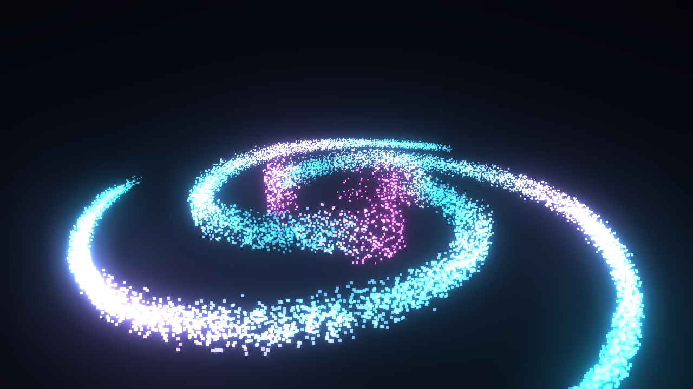

---

## Quick start

1. Download or clone this repo.
2. Double-click `index.html` (it opens in your default browser — use **Chrome** or **Edge**).
3. Start playing music.
4. Click **🔊 System Audio**. In the share dialog that appears, choose **Entire screen** and tick **"Also share system audio"**, then click Share.

That's it. The visuals should start moving with the music.

> **Not sure it's working?** Click **▶ Demo Signal** first. That plays a built-in synthetic 120 BPM pattern (silently — it's generated math, not sound) so you can confirm the graphics run before wrestling with audio permissions.

### Alternative: run it from a local server

Opening the file directly works fine, but a few browsers restrict microphone and screen-capture APIs on `file://` URLs. If a source refuses to start, serve it over `localhost` instead:

```bash
python -m http.server 8080
```

Then open <http://localhost:8080>. Any static server works — `npx serve`, `php -S localhost:8080`, VS Code's Live Server extension, whatever you have.

---

## How the system audio capture works

This is the part people get stuck on, so it's worth explaining.

Browsers have no direct API for "give me the sound my speakers are making." The workaround is the **screen sharing** API: when you share a screen or a tab, Chrome and Edge on Windows will optionally include the system audio stream alongside the video. The visualizer grabs that stream, throws the video away, and analyzes only the audio.

Practical consequences:

- **You must tick the "Also share system audio" checkbox.** If you miss it, you'll get an error telling you no audio track was shared. Just click the source button again and retry.
- **Pick "Entire screen," not "Window."** Window-sharing does not carry audio on Windows. Sharing a specific *browser tab* does work and is a good option if you only want one tab's sound (e.g. just YouTube, ignoring Discord notifications).
- **Chrome and Edge only.** Firefox and Safari don't support system audio capture. Both still work fine with the microphone and demo sources.
- **Nothing is recorded or uploaded.** The stream goes to an analyzer node and nowhere else. The page has no network code at all beyond loading the Three.js library. It's never connected to your speakers either, so there's no echo or feedback.
- Windows shows a "sharing your screen" indicator while it runs. That's expected — it's the price of the loopback trick.

**Microphone mode** is the fallback if system capture won't cooperate, and it's genuinely more fun with speakers in a room — it picks up the actual acoustics, room reverb and all. It will also pick up you talking, so mind that if you're streaming.

---

## Controls

| Input | Action |
|---|---|
| Drag | Orbit the camera |
| Scroll | Zoom in / out |
| `1` – `9`, `0` | Switch visual mode (`0` is the tenth) |
| `T` | Cycle color theme |
| `A` | Toggle auto-cycle |
| `H` | Hide / show the UI panel |
| `F` | Toggle fullscreen |

Most modes slowly auto-rotate until the first time you drag the camera, then it stays where you put it. Switching modes resets the camera to that mode's preferred framing. Tunnel, Terrain, and Drift deliberately don't auto-rotate — they're built around a fixed forward view.

### Panel controls

- **Source** — switch between System / Mic / Demo at any time without reloading.
- **Mode** and **Theme** — same as the keyboard shortcuts.
- **Sensitivity** — the master gain on everything reactive. Turn it **up** for quiet or heavily-compressed tracks, **down** if loud passages look like a solid blown-out wall. This is the single most useful knob; expect to touch it when you change genres.
- **Glow** — bloom intensity. Low values look sharp and technical, high values look hazy and dreamlike.
- **Backdrop** — load your own image to sit behind the visuals (see below).
- **Auto-cycle** — hands-off mode: rotates through all ten visuals every 30 seconds and advances the theme every 95 seconds. This is what you want for a second monitor.
- The bar meters at the bottom show live bass / mid / treble levels. If they're flat while music is playing, the audio source isn't connected — recheck the share dialog.

---

## The visual modes

**1 · Nebula** — 14,000 particles in a three-armed spiral galaxy. Radius maps to frequency: the inner core rides the bass, the outer arms shimmer with the treble. The whole galaxy spins faster as the track gets more energetic, and particles bloom on detected beats. Best for ambient, drum & bass, anything with a wide frequency spread.

**2 · City** — a 25×25 grid of neon blocks arranged as a cyberpunk skyline. Height and color follow the spectrum radially outward from the center, so kick drums punch up the middle and hi-hats ripple around the edges. Try zooming down to street level and looking up.

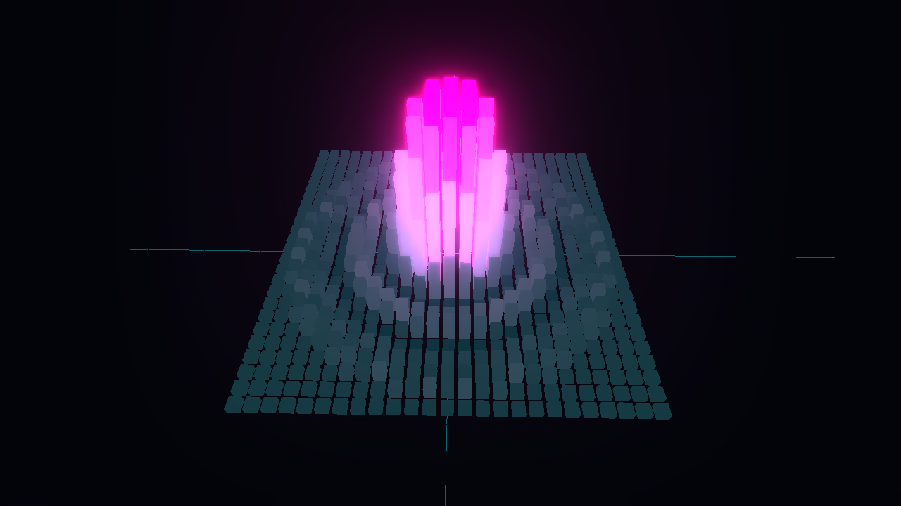

**3 · Core** — a plasma sphere wrapped in a neon lattice. Bass inflates it, mids ripple the surface into churning noise, treble drives the orbiting sparkle field, and the whole thing kicks on each beat. The most "reactive-looking" of the three; good for bass-heavy music.

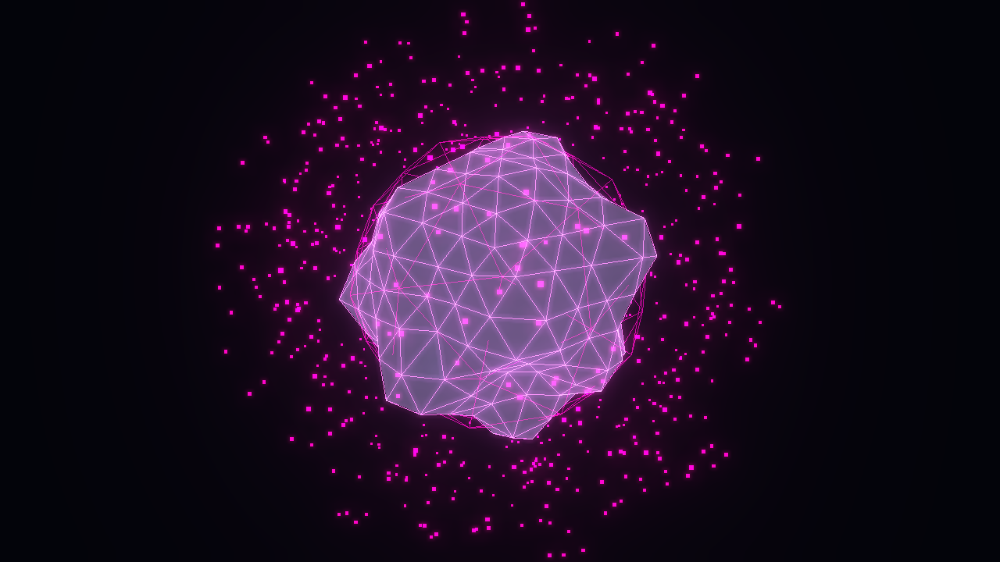

**4 · Tunnel** — an endless flythrough down a wireframe tube that snakes as it goes. Each ring is a frozen snapshot of the spectrum taken the moment it spawned at the far end, so you are literally flying backwards through the last few seconds of the track. Bass carves the bulge; the whole tube twists faster as the mids rise.

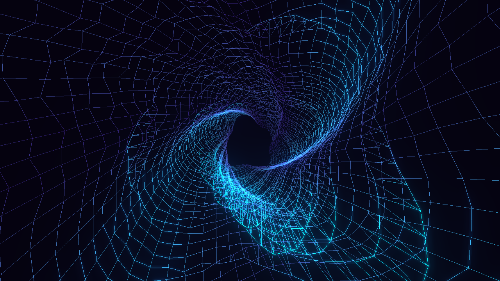

**5 · Terrain** — a scrolling spectrogram rendered as landscape. Frequency runs left-to-right, time runs toward you, and amplitude is elevation, so a sustained bassline builds a ridge you watch travel the length of the valley. Roughly four seconds of history is on screen at once. The most *readable* mode — you can pick out song structure in the hills.

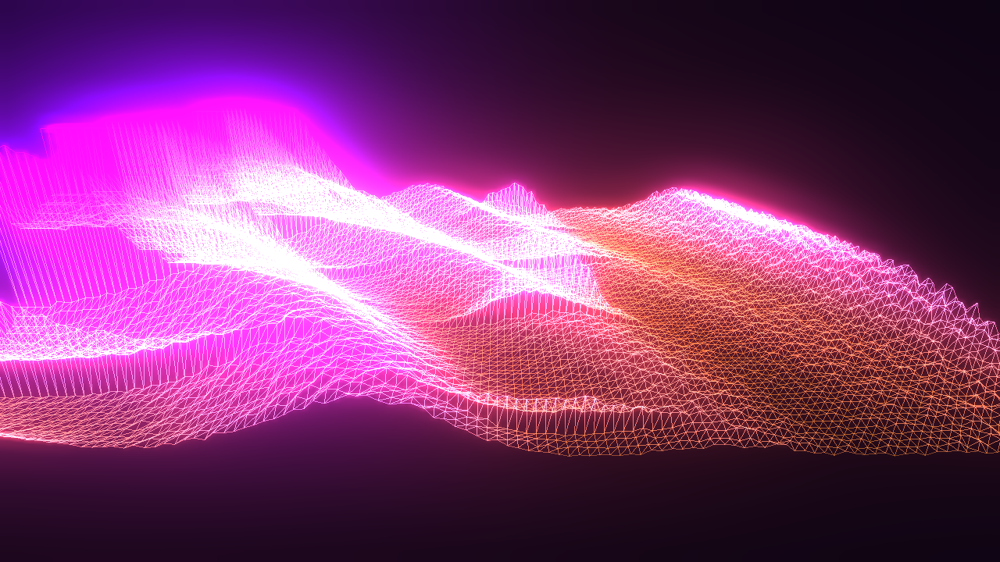

**6 · Vortex** — an accretion disk falling into a black hole. Particles orbit on a genuine Keplerian profile (angular speed ∝ r^-1.5), so the inner disk shears visibly against the rim. Bass drags the whole disk inward, and every detected beat fires a shockwave ring that lifts particles as it passes.

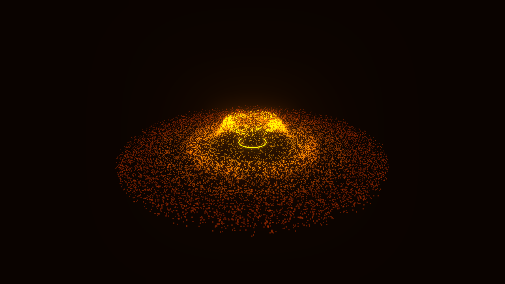

**7 · Attractor** — a live Lorenz strange attractor, 15,000 particles integrated through the chaos equations every frame. The music drives the parameters: mids push **ρ** (how violently it churns), treble bends **σ**, and overall energy sets the tempo. Colour tracks each particle's velocity, so the slow fixed-point cores glow one colour and the fast outer sweeps another. Never repeats — that's the whole point of a strange attractor.

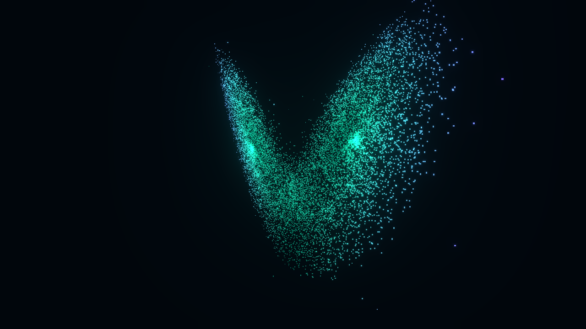

**8 · Drift** — the chill one, built for lounge, downtempo and lo-fi. It's a spectrogram like Terrain, but tuned the opposite way: a **24-second** window instead of four, rows that are time-averaged rather than instantaneous, gentle relief instead of jagged peaks, and no beat reactions at all. Quiet music that makes Terrain look like a flat line builds slow, rolling dunes here — you can watch a whole phrase drift past. Dust motes float through it, and the camera sways instead of orbiting.

Because it averages ~5 frames into every row and tilts gain upward across the spectrum, soft brushed hi-hats and vinyl crackle register as visible texture rather than vanishing under the bassline. Pair it with the **Lo-Fi**, **Twilight**, or **Sage** palettes.

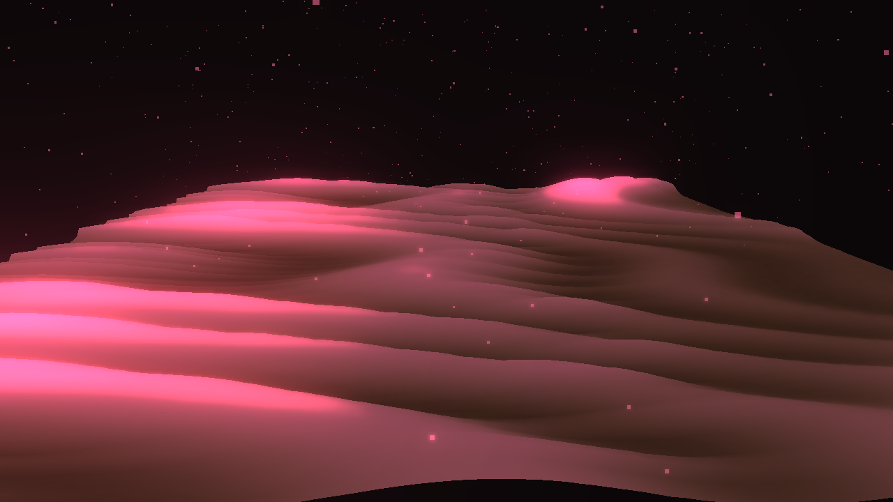

**9 · Equalizer** — the classic bar spectrum, rebuilt in 3D. 56 bars, each with a gradient baked in so the tip burns hotter than the base, and the two details that make an EQ feel *right*: **peak-hold caps** that snap up instantly then fall away under gravity, and a **mirrored reflection** below the floor line. Bars rise fast and fall slow, the way a real meter behaves. The most legible mode of the lot — you can actually read the spectrum off it.

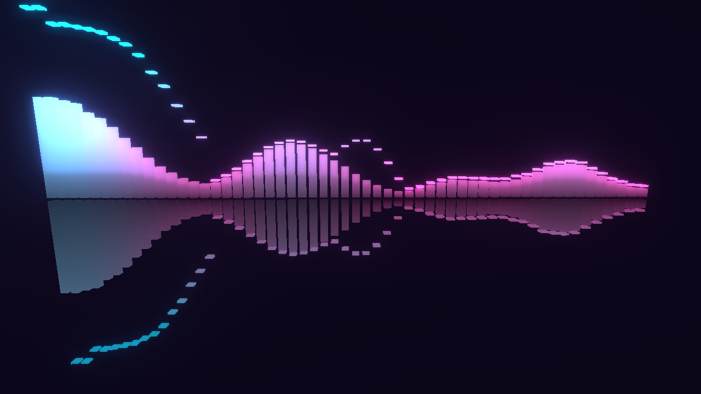

**10 · Singularity** — matter falling into a black hole. Where Vortex is a stable flat disk, these particles stream in from **every direction** under real inverse-square gravity, on decaying orbits that spiral inward. Each one draws a streak scaled to its velocity, so distant matter reads as faint dots and infalling matter stretches into long tails as it accelerates. Cross the event horizon and you're **destroyed and respawned far away** — and the photon ring brightens in proportion to how fast it's actually feeding. Every beat fires a gravity surge that yanks the whole field inward.

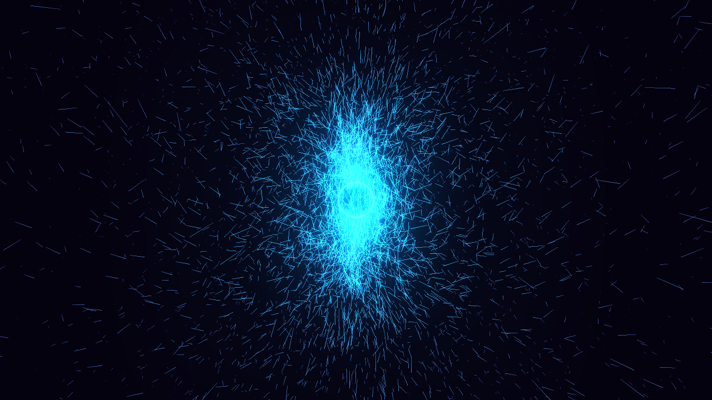

### Themes

Twelve palettes. The bright ones: **Cyberpunk** (cyan/magenta), **Synthwave** (orange/purple), **Matrix** (green), **Ice** (blue/white), **Inferno** (fire), **Toxic** (acid green), **Vaporwave** (pink/teal), **Aurora** (mint/violet), **Ultraviolet** (deep purple/electric blue).

The muted ones, meant for quiet listening: **Lo-Fi** (warm amber/dusty rose), **Twilight** (soft blue/pink), **Sage** (mint/cream). Click a swatch or press `T` to cycle.

Theme changes the whole mood, not just the hue. Here's Nebula under Synthwave — same geometry as the header image, completely different feel:

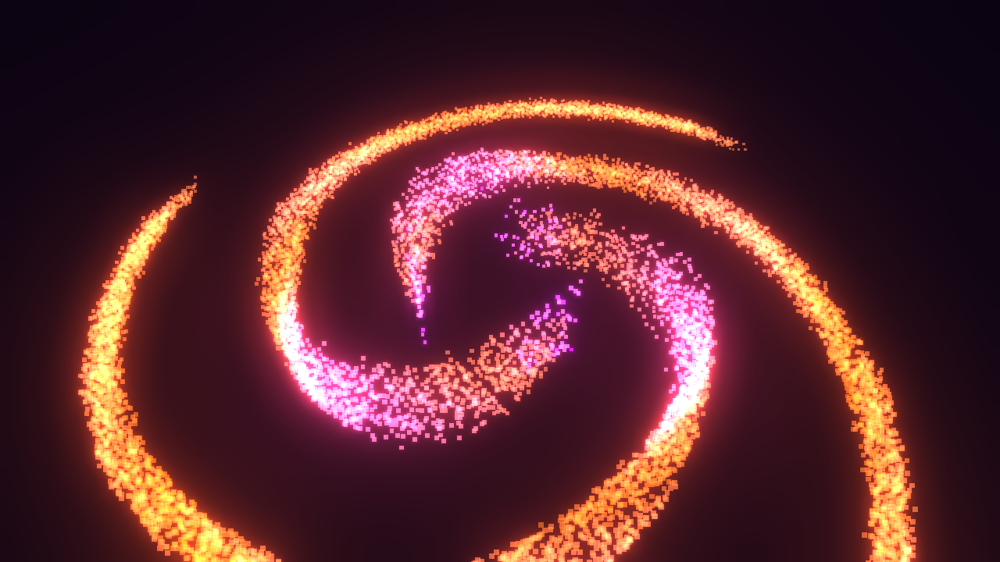

---

## Backdrop images

Click **Image…** in the Backdrop row to drop any picture behind the visuals — a logo, album art, a photo, a band mark. **PNG transparency is preserved**, so a logo on a transparent background floats over the theme colour rather than sitting in a box.

- The **Opacity** slider controls how strongly it reads. Default is a deliberately subtle 0.3.
- The image is fitted to be fully visible (never cropped) and stays locked behind the visuals — it won't swing out of frame when you orbit the camera.
- It's remembered between sessions, so you set it once. **Clear** removes it.
- Your file never leaves the machine. It's read locally in the browser and stored only in your own browser storage — there's no upload and no server involved.

Two practical notes. Bright or near-white images pick up the bloom and will glow noticeably — if yours washes out the visuals, pull the opacity down or use darker artwork. And images above roughly 3.5 MB still work for the session but are too large to save, so they won't survive a reload; resize large photos first.

---

## Tips

- **Press `H` then `F`.** Hiding the UI and going fullscreen is what makes this feel like a real visualizer rather than a web demo. This is the intended way to actually use it.
- **Put it on a second monitor with `A`.** Fullscreen it on a spare display, turn on auto-cycle, and leave it running while you work or play. It'll happily run for hours and never sit on the same visual for long.
- **Match the mode to the music.** Lounge, chill and lo-fi belong in **Drift** — the other modes are built around transients that this music doesn't have, and will mostly sit still. Sparse, slow tracks with real bass hits look best in Core or Vortex. Dense, busy tracks suit Nebula, City, or Terrain. Four-on-the-floor dance music is what Vortex's and Singularity's beat surges were built for. **Equalizer** works with anything and is the one to pick if you want to *read* the music rather than just watch it.
- **The spectrogram modes need to warm up.** Both start flat because their history buffers are empty — about four seconds for Terrain, and a full **24 seconds** for Drift before the picture is complete. Drift is worth the wait; don't judge it at five seconds.
- **Drift likes more sensitivity.** Chill music is quiet and often gently mastered. If the dunes look flat, push sensitivity to 1.5–2.0 — much more headroom than you'd want on the punchier modes.
- **Sensitivity is genre-dependent.** Modern loudness-war masters sit near the sensitivity floor — drop to ~0.7. Classical, jazz, and vinyl rips often need 1.8+ to come alive.
- **Fixing choppy playback:** the visualizer is GPU-bound. If it stutters, make a smaller browser window (fewer pixels), or drop Glow toward 0 — bloom is by far the most expensive effect. Attractor is the heaviest mode on the CPU (75,000 integration steps per frame); Core is the lightest.
- **Verify your GPU is actually being used.** If everything is slow, check `chrome://gpu` for "Hardware accelerated" on WebGL. Some Windows setups run browsers on the integrated GPU; in Windows Settings → System → Display → Graphics, set your browser to High performance.
- **Sharing a browser tab instead of the whole screen** gives you cleaner audio when you want to visualize one source and ignore system notification sounds.

---

## Customizing it

Everything lives in `index.html` — no build step, so edit and refresh.

- **Add a theme:** append an entry to the `THEMES` array near the top of the script — an accent color `a`, secondary `b`, background `bg`, and fog color, all as hex numbers. The swatch row builds itself from that array, so a new palette shows up in the UI with no other changes.
- **Add your own mode:** subclass `VisualMode`, build geometry in the constructor, and implement `update(freq, levels, dt, t, sensitivity)`. `freq` is the raw 1024-bin FFT as a `Uint8Array`; `levels` gives you smoothed `bass` / `mid` / `treble` / `energy` floats plus a `beat` boolean. Then add one entry to the `MODES` registry with your class and a camera preset — the buttons and number-key bindings are generated from it.
- **Camera presets** live in that same `MODES` registry: `pos` is the starting camera position, `min`/`max` clamp zoom, and `rot` is auto-rotate speed (`0` disables it). Note the vertical field of view is fixed, so on a widescreen monitor you get more horizontal room rather than a larger subject — that's why the distances are tuned fairly close.
- **Change particle count:** `const N = this.N = 14000` in `Nebula`, `16000` in `Vortex`, `15000` in `Attractor`. Push them up on a strong GPU, down on a laptop.
- **Change the city grid:** `const S = this.S = 25` in the `City` class. Note it's squared, so 40 means 1,600 blocks.
- **Change how much history the spectrograms show:** `rowDur` (seconds per row) × `D` (rows) is the window. Terrain is `0.042 × 90 ≈ 3.8 s`; Drift is `0.2 × 120 = 24 s`. Raise `rowDur` for a longer, slower scroll.
- **Rebalance Drift across the spectrum:** its `this.gain[i]` curve tilts response upward with frequency to offset music's natural 1/f falloff. Flatten it toward a constant if you want a literal, untilted spectrogram.
- **Tune beat detection** in `AudioEngine.update()` — it compares current bass against a rolling 50-frame average with a 160 ms refractory period. Lower the `1.35` multiplier for more sensitive triggering. Vortex's shockwaves, Singularity's gravity surge and the bloom pulse all key off this.
- **Change the EQ's feel:** `rise` and `fall` in `Equalizer.update()` set how fast bars track the music (fast up, slow down), and `this.peakV[i] += dt * 26` is the gravity on the peak caps — lower it for caps that hang longer.
- **Change the black hole:** `this.G` is the gravitational constant and `this.horizon` the kill radius in `Singularity`. The `K = 0.25` constant sets streak length in seconds of travel — raise it for longer comet tails.

---

## Requirements

- A modern browser with WebGL2. Chrome or Edge recommended; required for system audio capture.
- An internet connection **on first load** — Three.js is fetched from a CDN. If it can't load, a red banner appears at the bottom of the page rather than a mysterious black screen. To run fully offline, download `three.module.js` and the four addon files and repoint the import map.

Built with [Three.js](https://threejs.org/) r160 and the Web Audio API. No frameworks, no bundler, no dependencies to install.

## Troubleshooting

| Symptom | Fix |
|---|---|
| "No audio track was shared" | You missed the **Also share system audio** checkbox. Retry and tick it. |
| Black screen, red banner at the bottom | Three.js couldn't load from the CDN. Check your connection and reload. |
| Visuals run but never move | Wrong source, or the media is muted. Check the bass/mid/treble meters; try Demo to confirm the graphics work. |
| "Permission denied" | You dismissed the browser prompt. Click the source button again and allow it. |
| Everything is a blown-out white blob | Sensitivity too high. Slide it down. |
| Barely any movement on loud music | Sensitivity too low, or you're capturing a silent source. |
| Choppy / low frame rate | Lower Glow, shrink the window, or switch from Nebula to Core. |
| Drift looks flat or empty | Give it the full 24 seconds to fill, then raise sensitivity — chill tracks are quiet. |
| Backdrop washes out the visuals | Bright images bloom. Lower the Opacity slider or use darker artwork. |
| Backdrop vanishes after reload | Over ~3.5 MB it's too big to save. Resize the image and load it again. |

## License

MIT — see [LICENSE](LICENSE). Use it, fork it, rip the modes out for your own project.
